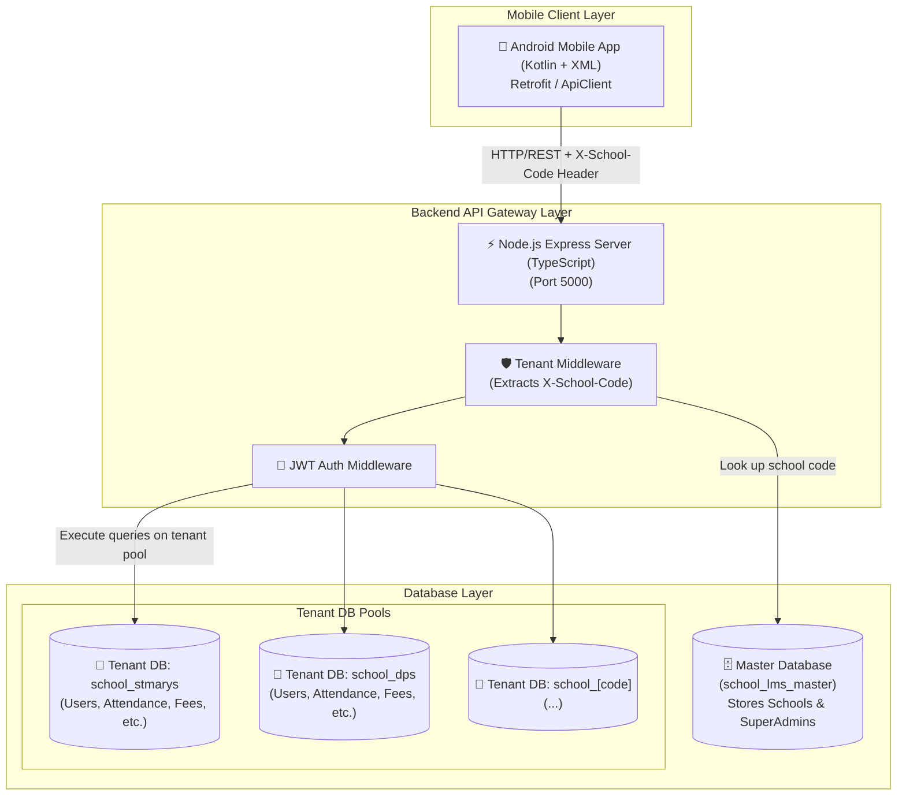
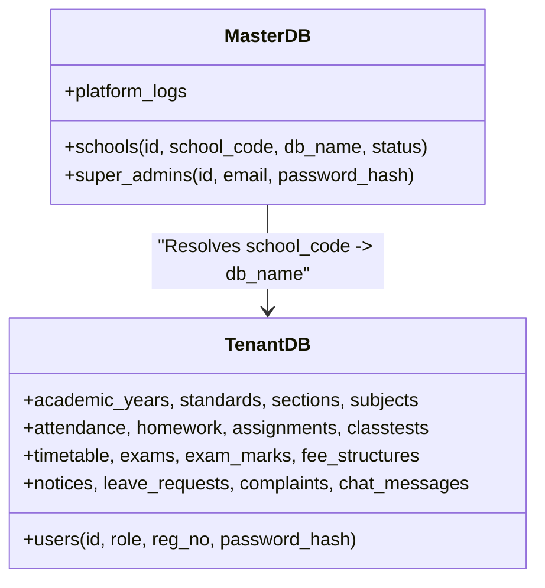
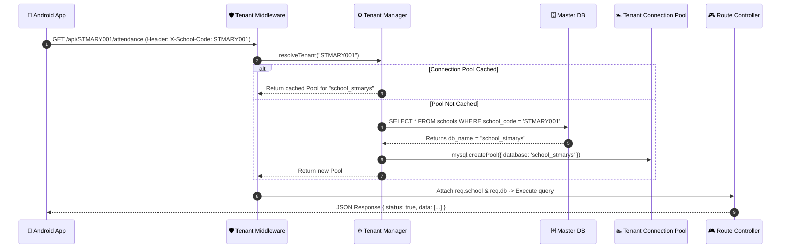
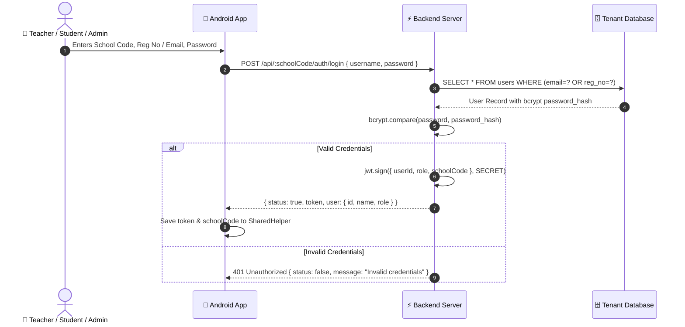

# 🏗️ Multi-Tenant School LMS - System Architecture Document

Welcome to the **School LMS Architecture Document**! This document provides a complete technical blueprint of the system, designed to help freshers and senior developers understand the high-level architecture, database isolation model, network request lifecycle, and component interactions.

---

## 📌 1. High-Level Architecture Overview

The system is a **Multi-Tenant School Learning Management System (LMS)** consisting of two primary components:
1. **Node.js + Express + TypeScript Backend API**: Handles business logic, authentication, multi-tenant database routing, file uploads, and platform management.
2. **Native Android Mobile App (Kotlin + XML)**: The client application used by School Admins, Teachers, Students, and Parents to interact with the platform.



---

## 🗄️ 2. Multi-Tenancy Architecture (Database-per-Tenant)

Our application implements a **Database-per-Tenant** isolation model. Every school onboarded to the system gets its own physically separate MySQL database.

### Why Database-per-Tenant?
* **Data Security & Privacy**: Complete isolation ensures one school's data can never bleed into another school's queries.
* **Scalability**: Individual school databases can be backed up, migrated, or hosted on separate database servers as the platform grows.
* **Custom Customization**: Allows schema modifications per school if needed in the future.

### Master Database vs. Tenant Databases



1. **Master Database (`school_lms_master`)**:
   - Platform-level database.
   - Contains `schools` registry table (`school_code` -> `db_name`).
   - Contains `super_admins` table for platform owners.

2. **Tenant Database (`school_[code]`, e.g., `school_stmarys`)**:
   - Contains all school-specific data: Students, Staff, Attendance, Homework, Grades, Fees, Notices, Timetables, etc.

---

## 🔄 3. School Tenant Resolution & Connection Pooling

When a request arrives at the backend:



### Dynamic Pool Caching (`tenantManager.ts`)
* To avoid creating new database connections on every HTTP request, connection pools are cached in memory using a JavaScript `Map<string, Pool>()`.
* Key: Database Name (e.g. `school_stmarys`).
* Value: MySQL Connection Pool (Limit: 10 connections).

---

## 📱 4. Android Mobile App Architecture (Kotlin + XML)

The Android mobile application follows a modular activity-driven pattern with centralized networking and session helpers.

```
School-MobileApp/
├── app/src/main/java/com/lms/sch/
│   ├── activity/             # Android UI Activities (Login, Splash, Academic, etc.)
│   ├── fragment/             # Reusable UI Fragments
│   ├── adapter/              # RecyclerView Adapters for Lists
│   ├── network/              # Retrofit & OkHttp API Layer
│   │   ├── ApiClient.kt      # Centralized HTTP request engine
│   │   ├── ApiConnection.kt   # Endpoint URLs and payload mapping
│   │   ├── AddCookiesInterceptor.kt
│   │   └── ReceivedCookiesInterceptor.kt
│   ├── session/              # User Preferences & Token Storage
│   │   ├── SharedHelper.kt   # SharedPreferences wrapper
│   │   └── Constants.kt      # App Configuration & Server Base URL
│   └── models/               # Data Models / Data Transfer Objects (DTOs)
```

### Key Highlights:
* **Session Persistence**: User authentication tokens (`jwt_token`) and selected `school_code` are saved locally using Android `SharedPreferences`.
* **Automatic Header Injection**: Every outgoing network request via `ApiClient` automatically appends:
  * `X-School-Code`: Saved school code.
  * `Authorization`: `Bearer <jwt_token>`.

---

## 🔐 5. Security & Authentication Flow



---

## 📊 6. Database Schema Quick Reference

### Master DB Tables
* `schools`: `id`, `school_code`, `school_name`, `db_name`, `status` (`active`/`inactive`), `created_at`.
* `super_admins`: `id`, `name`, `email`, `password_hash`, `created_at`.

### Tenant DB Tables (Per School)
* **Users & Roles**: `users` (`role`: `superadmin`, `admin`, `teacher`, `student`, `parent`).
* **Academics**: `academic_years`, `standards` (Classes), `sections`, `subjects`, `teacher_subject_assignments`.
* **Daily Operations**: `attendance`, `homework`, `assignments`, `classtests`, `projects`.
* **Exams & Marks**: `exams`, `exam_schedules`, `exam_marks`.
* **Finance**: `fee_components`, `fee_structures`, `student_fee_payments`.
* **Communication**: `notices`, `leave_requests`, `complaints`, `chat_messages`.

---

## 🎯 Summary for Freshers
1. **Always send `X-School-Code` header** when calling backend APIs.
2. **Never query `school_lms_master` directly** for student/teacher data. Use `req.db` attached by `tenantMiddleware`.
3. **Backend uses pure Promises with `mysql2/promise`**, so use `async/await` and parameterized queries (`?`) to prevent SQL injection.
