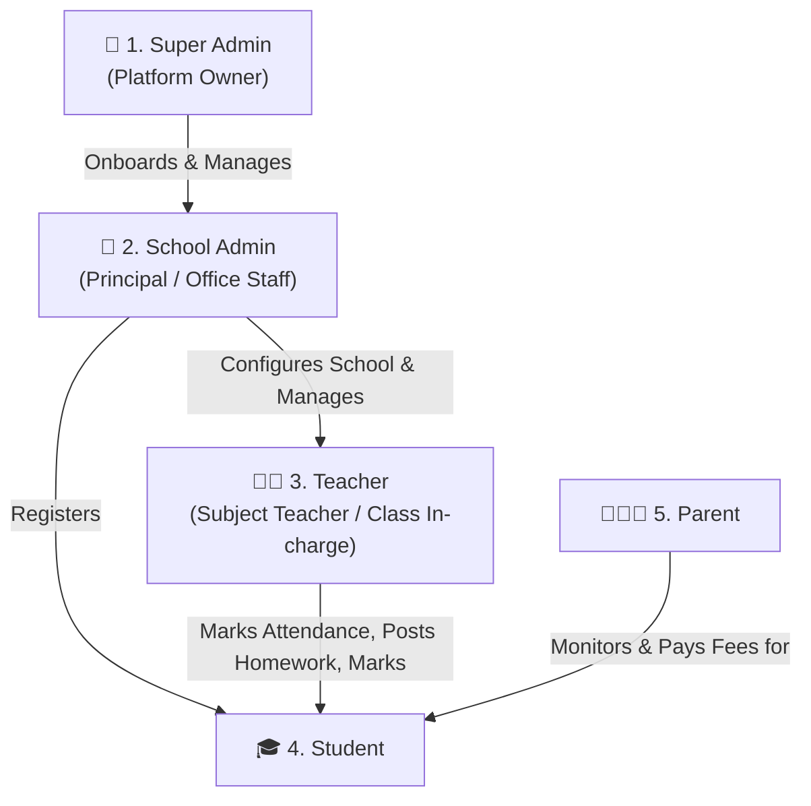
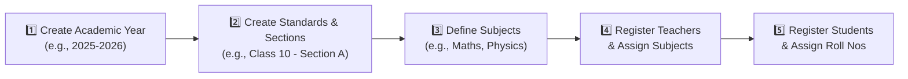
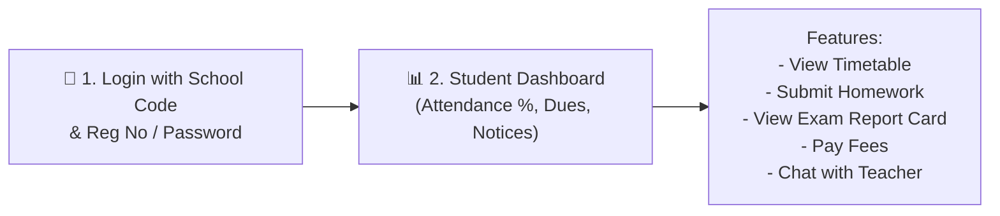

# 📖 Multi-Tenant School LMS - Complete User Manual & Operational Guide

Welcome to the **School LMS User Manual**! This guide is created for system administrators, school managers, teachers, students, parents, and freshers who want to understand how to operate and use the platform step-by-step.

---

## 👥 1. User Roles & Access Hierarchy

The system defines 5 user roles:



---

## 👑 2. Platform Super Admin Operations

The **Super Admin** manages the entire SaaS platform and onboards new schools.

### Step 1: Onboard a New School
To onboard a new school (e.g. "Delhi Public School"):
1. Call the Super Admin endpoint or use the CLI command:
   ```bash
   npm run provision:school -- --code DPS001 --name "Delhi Public School"
   ```
2. The platform automatically:
   - Registers `DPS001` in the master database (`school_lms_master`).
   - Provisions a new isolated database named `school_dps001`.
   - Creates default admin credentials for the school.

---

## 🏫 3. School Administrator Guide (Initial Setup Workflow)

When a school is newly created, the **School Admin** must complete this initial setup:



### Step 1: Academic Setup
* Navigate to **Academic Management**.
* Add the active **Academic Year** (e.g. `2025-2026`).
* Add **Standards** (e.g. `Grade 1` to `Grade 12`).
* Add **Sections** under each standard (e.g. `Section A`, `Section B`).

### Step 2: Staff & Student Registration
* Register Teachers with Email, Phone, and Subject specialization.
* Register Students with Registration Number, Roll Number, Class, Section, and Parent Details.

---

## 👩‍🏫 4. Teacher Daily Operational Guide

Teachers interact with the system daily to manage classroom activities:

### 1. Marking Daily Attendance
1. Open the Mobile App or Teacher Dashboard.
2. Select Class & Section.
3. Mark students as **Present**, **Absent**, or **Late**.
4. Click **Submit Attendance**. (Parents receive instant notifications for absent students).

### 2. Posting Homework & Assignments
1. Go to **Homework Section**.
2. Select Class, Subject, and Submission Due Date.
3. Attach PDF / Image instructions.
4. Publish homework.

### 3. Class Tests & Exam Marks Entry
1. Go to **Exams / Class Tests**.
2. Select Subject and Max Marks (e.g., 50 Marks).
3. Enter marks for each student.
4. Click **Publish Results**.

---

## 🎓 5. Student & Parent Mobile App Guide

Students and Parents use the native Android application to stay updated.



### How to Log In on the Mobile App:
1. Open **School LMS App** on your Android device.
2. Enter your **School Code** (e.g. `STMARY001`).
3. Enter your **Registration Number / Email** and **Password**.
4. Tap **Sign In**.

---

## ❓ 6. Frequently Asked Questions & Troubleshooting for Freshers

### Q1: App shows "Missing school code" error
* **Cause**: The `X-School-Code` header is missing from the HTTP request.
* **Fix**: Ensure `SharedHelper.getInstance(context).getSchoolCode()` has saved a valid school code during login and passes it to `ApiClient`.

### Q2: Cannot connect to Backend Server from Mobile App / Emulator
* **Cause**: Emulator using `localhost` instead of special loopback IP.
* **Fix**: Change server base URL in `Constants.kt` to `http://10.0.2.2:5000/api/` for Android Emulator, or your computer's local Wi-Fi IP (e.g. `http://192.168.1.15:5000/api/`) for physical phones.

### Q3: MySQL "Access Denied" or Connection Refused Error
* **Fix**: Check `school-backend/.env` file and verify your `DB_USER` and `DB_PASSWORD`. Ensure MySQL service is running (`net start MySQL80` on Windows).
